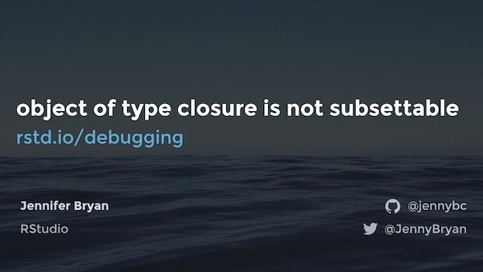

# Object of type 'closure' is not subsettable

Talk developed for [rstudio::conf 2020](https://rstudio.com/conference/), January 27 - 30, 2020 in San Francisco  
by Jenny Bryan  
[jennybryan.org](https://jennybryan.org)  
Twitter: [@jennyBryan](https://twitter.com/JennyBryan)  
GitHub: [@jennybc](https://github.com/jennybc)  

> Your first "object of type 'closure' is not subsettable" error message is a big milestone for an R user. Congratulations, if there was any lingering doubt, you now know that you are officially programming! Programming involves considerably more troubleshooting and debugging than many of us expected (or signed up for). The ability to solve your own problems is an incredibly powerful stealth skill that is worth cultivating with intention. This talk will help you nurture your inner problem solver, covering both general debugging methods and specific ways to implement them in the R ecosystem.

## Link to this repo

[rstd.io/debugging](https://rstd.io/debugging) is a shortlink to HERE

## Slides

Slides [on SpeakerDeck](https://speakerdeck.com/jennybc/object-of-type-closure-is-not-subsettable)

Slides [as PDF file](debugging-jenny-bryan.pdf) here in this repo 

## Video

The original rstudio::conf talk was live-streamed and recorded. Video is available here:

<https://resources.rstudio.com/rstudio-conf-2020/object-of-type-closure-is-not-subsettable-jenny-bryan>

## Credits and resources

Annotated and hyperlink-y list of resources mentioned in the slides, in roughly the same order.

---

Restart R, often, and don't save/reload `.Rdata`.

This recommendation is explored more thoroughly in [Save source, not the workspace](https://rstats.wtf/save-source.html). This mindset works best as part of a more holistic "project-oriented workflow", which is described in adjacent sections of [What They Forgot to Teach You About R](https://rstats.wtf/index.html).

---

> One of the most useful things I’ve learned from hanging out with (much) better programmers: don’t wring hands and speculate. Work a small example that reveals, confirms, or eliminates something.

I'm paraphrasing my own tweet: <https://twitter.com/JennyBryan/status/952285541617123328>

---

The reprex package: <https://reprex.tidyverse.org>

RStudio webinar about reprex: [Help me help you: Creating reproducible examples with reprex](https://reprex.tidyverse.org/articles/articles/learn-reprex.html)

---

The REPREX section features several illustrations by [Christine Kuper](https://christinekuper.com).

We gratefully acknowledge [Michelle Rial](https://www.michellerial.com) and her charts for an inspiring visual style.

---

The example of how a wild-caught puzzle evolves into a good reprex was kindly donated by [Brooke Watson Madubuonwu](https://twitter.com/brookLYNevery1).

Story concluded in [tidyverse/dplyr#4094](https://github.com/tidyverse/dplyr/issues/4094).

---

GitHub search for Hadley's "slightly more minimal reprexes": [`more minimal reprex NOT advice user:tidyverse user:r-lib user:hadley involves:hadley is:issue`] [`more minimal reprex NOT advice user:tidyverse user:r-lib involves:hadley is:issue`](https://github.com/search?o=desc&q=more+minimal+reprex+NOT+advice+user%3Atidyverse+user%3Ar-lib+involves%3Ahadley+is%3Aissue&s=updated&type=Issues)

---

Presentation of a rather intimidating R message was inspired by a Far Side comic from Gary Larson. You know ... the one about Ginger the dog and "blah blah".

The Far Side very recently got a real online home: <https://www.thefarside.com>. However, last time I checked, this particular comic isn't there (yet). Hopefully it will appear one day and I can link to it.

---

All the code snippets from the `fruit_avg()` debugging example are in [R/](R).

---

[Debugging with RStudio](https://support.rstudio.com/hc/en-us/articles/205612627-Debugging-with-RStudio)

rlang's functions for [Errors, conditions, and backtraces](https://rlang.r-lib.org/reference/index.html#section-errors-conditions-and-backtraces)

---

Video of a tiny room hidden behind an electrical outlet is from Mozu Studios:

  * <https://www.mozustudios.com>
  * <https://www.instagram.com/p/B6NvxK7JnpU/>

---

> The major difference between a thing that might go wrong and a thing that cannot possibly go wrong is that when a thing that cannot possibly go wrong goes wrong it usually turns out to be impossible to get at and repair.

Quote attributed to [Douglas Adams](https://www.brainyquote.com/quotes/douglas_adams_124773), but I am not sure of the original source.

---

The tidyverse and r-lib packages have an *aspirational* and developing style guide for error messages:

<https://style.tidyverse.org/error-messages.html>

---

Static code snippets prepared with the [reprex package](https://reprex.tidyverse.org), using [`venue = "rtf"`](https://reprex.tidyverse.org/articles/articles/rtf.html), which relies on [highlight](http://www.andre-simon.de/doku/highlight/en/highlight.php).

GIFs of code prepared with [r-lib/asciicast](https://github.com/r-lib/asciicast) plus [asciinema/asciicast2gif](https://github.com/asciinema/asciicast2gif).

---

This talk benefitted greatly from:

  * Regular discussions with the rest of the tidyverse / r-lib team at RStudio
    - [tidyverse org members](https://github.com/orgs/tidyverse/people)
    - [r-lib org members](https://github.com/orgs/r-lib/people)
  * Visual design and art from Christine Kuper
    - <https://christinekuper.com>
  * Lightning talk on debugging the IDE given internally by RStudio engineer Jonathan McPherson

---

Image credits

Fret: https://unsplash.com/photos/OsC8HauR0e0
Do same thing again: https://unsplash.com/photos/uxUUENpp01I
Diver: https://unsplash.com/photos/wVvxjiLJr-g
Ocean horizon background: https://unsplash.com/photos/sYzFIusQp3Q
Calm sea background: https://unsplash.com/photos/IZ01rjX0XQA
Coral reef background: https://unsplash.com/photos/T1Wru10gKhg
Seaweed background: https://unsplash.com/photos/nAkC-KS444M
Orchid: https://unsplash.com/photos/Ug6z9PCwr58
Corn field: https://unsplash.com/photos/nCQXxsSg3oo
On/off key: https://unsplash.com/photos/cw_uvISXkCI
Sunlight under water background: https://unsplash.com/photos/K785Da4A_JA  
Garnishing with sauce: https://unsplash.com/photos/YaiY50wzWzI  
Death certificate (modified): Public Domain, https://commons.wikimedia.org/w/index.php?curid=214170  
Sunlight under water background: https://unsplash.com/photos/K785Da4A_JA
Washing pot: https://unsplash.com/photos/-VhH4S1Lur8
The Night King: https://cnet4.cbsistatic.com/img/vugy5MvUVBvwcJf0JvKIBd1RwJE=/1200x675/2019/04/22/2b2fee8d-111a-4d19-ae83-4e61899cfd47/1nightking.jpg (probably copyright HBO)
Autopsy painting by Rembrandt: https://www.mauritshuis.nl/en/explore/the-collection/artworks/the-anatomy-lesson-of-dr-nicolaes-tulp-146/detailgegevens/ Public Domain, https://commons.wikimedia.org/w/index.php?curid=64281722
Gray cube abstract wallpaper vector art https://unsplash.com/photos/1CVy8JStf3A
