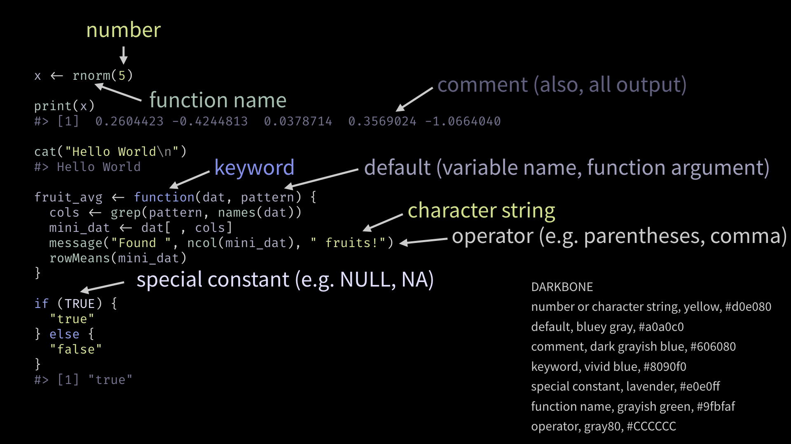
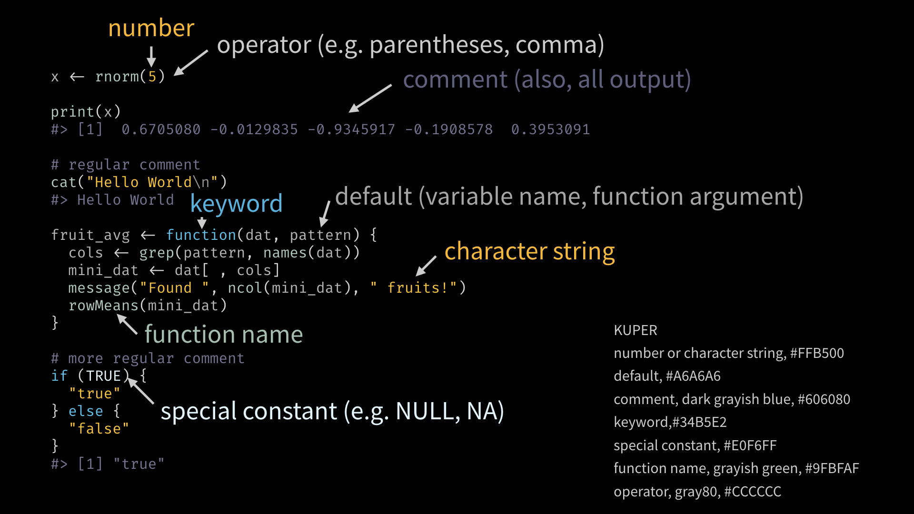

## How to use a custom theme with highlight (and reprex)

`reprex::reprex_rtf()` and `reprex:::prex_rtf()` shell out to [highlight](http://www.andre-simon.de/doku/highlight/en/highlight.php) to produce rendered, syntax-highlighted R snippets as RTF. Normally I just choose one of the themes that ship with highlight, such as Darkbone or Solarized Light, for dark and light slides, respectively. But for this talk I was curious to see if I could create a custom theme that is more consistent with the Keynote theme.

1. Find your existing themes. On my current system they are at `/usr/local/Cellar/highlight/3.47/share/highlight/themes`.
1. Copy one of these files, such as `darkbone.theme`, to `kuper.theme`, where "kuper" is whatever you plan to call this custom theme. Modify (or not), in order to conduct a pilot study. For example, you might want to make at least one color obvious and garish, to easily confirm things are working.
1. Specify the custom theme file via `--config-file` with a test `.R` file (such as a commented R file obtained via `reprex_r(input = "abc.R", outfile = NA)`):

        highlight abc_reprex_rendered.R --out-format rtf --no-trailing-nl \
          --encoding=UTF-8 --config-file kuper.theme > \
          abc_reprex_rendered.rtf
1. Method 1 for making the custom theme available through `--style` on the command line: move the theme to `~/.highlight/themes/kuper.theme`.
1. Method 2: store theme in the relevant project, but symlink it to `~/.highlight/themes/kuper.theme`.
1. Method 3: symlink `kuper.theme` into the main themes directory.
1. Regardless of method, you should now be able to specify the custom theme:

        highlight abc_reprex_rendered.R --out-format rtf --no-trailing-nl \
          --encoding=UTF-8 --style kuper > abc_reprex_rendered.rtf
1. To use the custom theme with reprex, specify it the usual way via the `reprex.highlight.hl_style` option:

        options(reprex.highlight.hl_style = "kuper")

## Details of a highlight theme

A theme file looks like this

```
Description = "custom theme for blah blah"

Default        = { Colour="#000000" }
Canvas         = { Colour="#ffffff" }
Number         = { Colour="#000000" }
Escape         = { Colour="#bd8d8b" }
String         = { Colour="#bd8d8b" }
StringPreProc  = { Colour="#bd8d8b" }
BlockComment   = { Colour="#ac2020", Italic=true }
PreProcessor   = { Colour="#000000" }
LineNum        = { Colour="#555555" }
Operator       = { Colour="#000000" }
LineComment = BlockComment

Keywords = {
 { Colour= "#9c20ee", Bold=true },
 { Colour= "#208920" },
 { Colour= "#0000ff" },
 { Colour= "#000000" },
}
```

Here's a visual look at Darkbone:



And same for "kuper", the custom theme for this talk:



Explanation:

  * **Default** is used for variable names, package names, and function
    arguments.
  * **Canvas** doesn't matter for reprex usage but indicates whether theme is
    designed for a dark or light background. It controls the background of a
    resulting `.rtf` file.
  * **Number** and **String** are for numbers and strings and are often the
    same.
  * **Escape** is for escaped characters, like the `\n` in a string.
  * **LineComment** is for comments and, in the case of a rendered reprex,
    R output.
  * **Operator** is for `(`, the assignment operator, `::`, etc.
  * I haven't fiddled with BlockComment, StringPreProc, PreProcessor,
    LineNum.
  * You can set one color to another, previous one, by name. Example:
    `LineNum = BlockComment`.
  * Keyword group 1: Things like `function()`, `if()`, and `for()`.
  * Keyword group 2: Special constants like `NULL`, `NA`, and `TRUE`.
  * Keyword group 3: *isn't actually defined in `r.lang`, so I don't know*
  * Keyword group 4: Function names.

## `r.lang`

Found at `/usr/local/Cellar/highlight/3.47/share/highlight/langDefs/r.lang`.

```
Description="R"

Identifiers=[[ [a-zA-Z_\.][\w]* ]]

Keywords={
  { Id=1,
    List={"if", "else", "repeat", "while", "function", "for", "in", "next", "break", "ifelse", "switch"},
  },
  { Id=2,
    List={"NULL", "NA", "Inf", "NaN", "TRUE", "T", "FALSE", "F"},
  },
  { Id=4,
    Regex=[[([\w+_\.]+)\s*\(]],
  }  
}

Strings={
  Delimiter=[["|']],
}

Comments={
  { Block=false,
    Delimiter= { [[#]] },
  },
}

Operators=[[\(|\)|\[|\]|\{|\}|\,|\;|\:|\&|<|>|\!|\=|\/|\*|\%|\+|\-|\~|\|]]

EnableIndentation=true
```

## Official docs

<http://www.andre-simon.de/doku/highlight/en/highlight.php#ch3_4>
